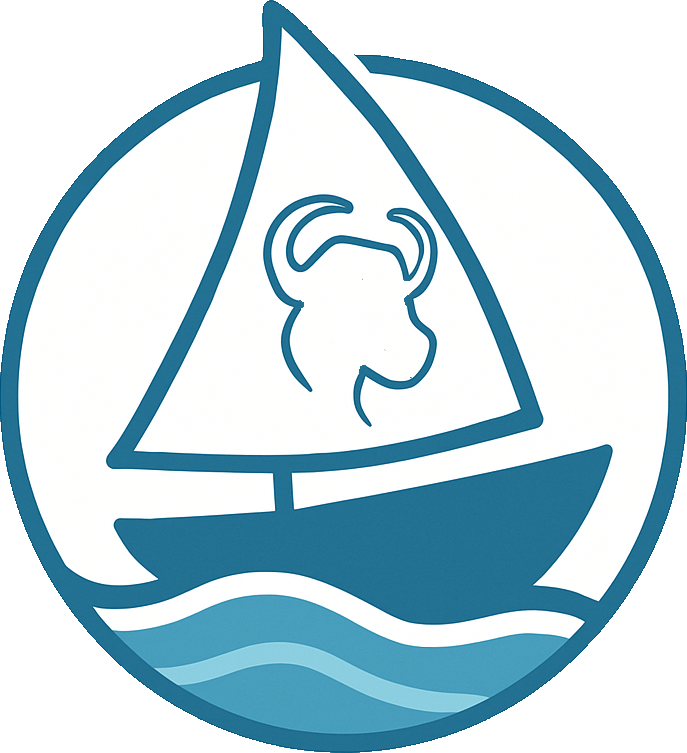

# OpenSailor.org

Sailing is about freedom. Sailing data should be to.
_(more to come)_

## Deploying Code
To deploy you need to create a new versioned [Release](https://github.com/pirate-baby/opensailor/releases). This should be in the format `v#.#.#` so `v1.2.33` is good, `v.1.2.33` is bad, so is `1.2.33`. When a release is published that will:
- Build the new _app_ container (not the `db_startup`, `nginx`, or `langfuse` containers, those are manual deploys for now).
- Extract the current ECS task def from tofu.
- Update the task def and upload it to ECS as a new task def with the version tag (ie `v0.1.1`).
- Kick off a new deployment.

## Infrastructure as Code (OpenTofu) - manually applied

Infrastructure for AWS ECS, ECR, Aurora, ALB, and S3 is managed in the `opentofu/` directory using OpenTofu (Terraform fork). See the files in `opentofu/` for details.

You run plan/apply locally by:
1. `docker compose run --rm opentofu`
2. paste in your [AWS Account Portal](https://d-9a676788cd.awsapps.com/start/#/?tab=accounts) creds.
3. do the IAC'ing.

once the infra is where you want it, push and merge to main. No need to release if you didn't change anything in the app that needs it (but feel free to if you did).